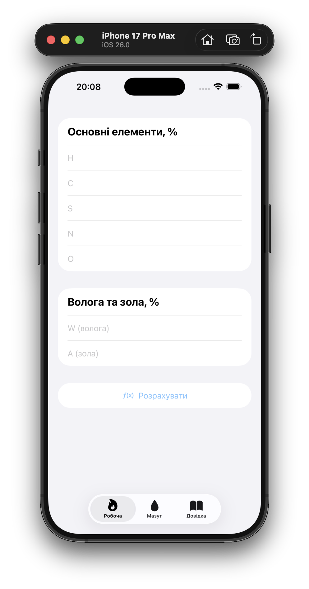
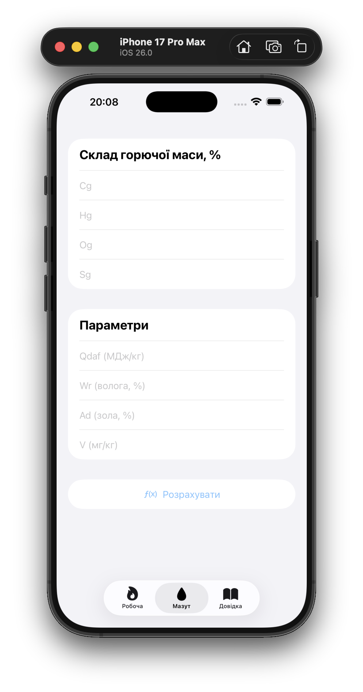
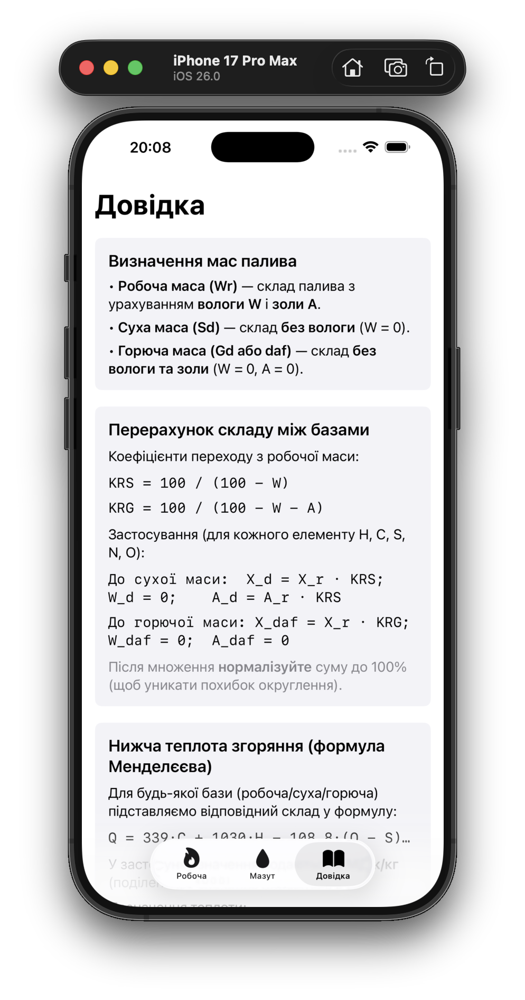
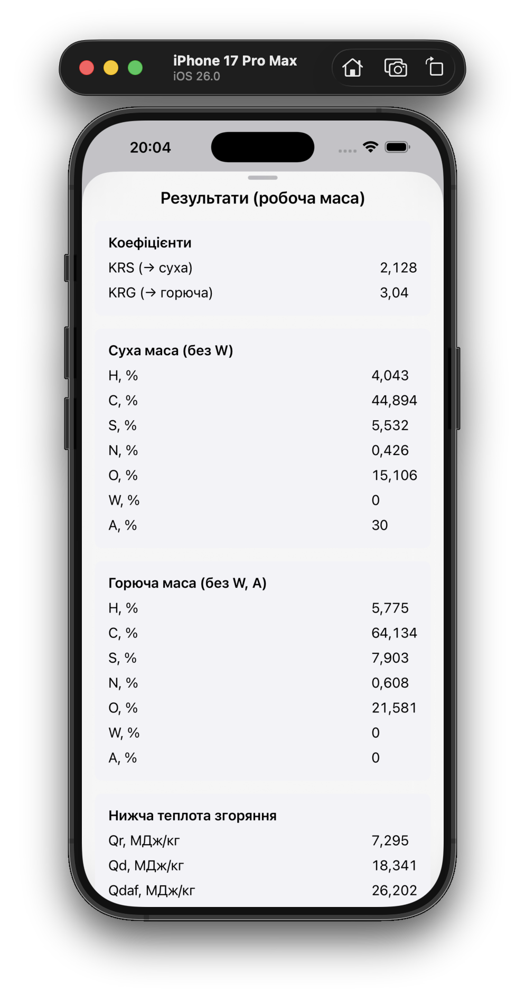
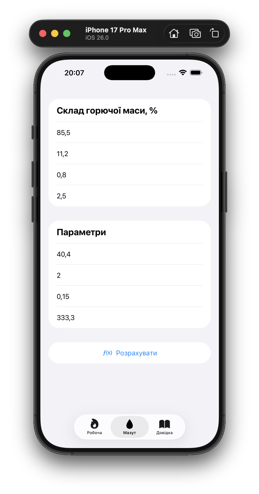
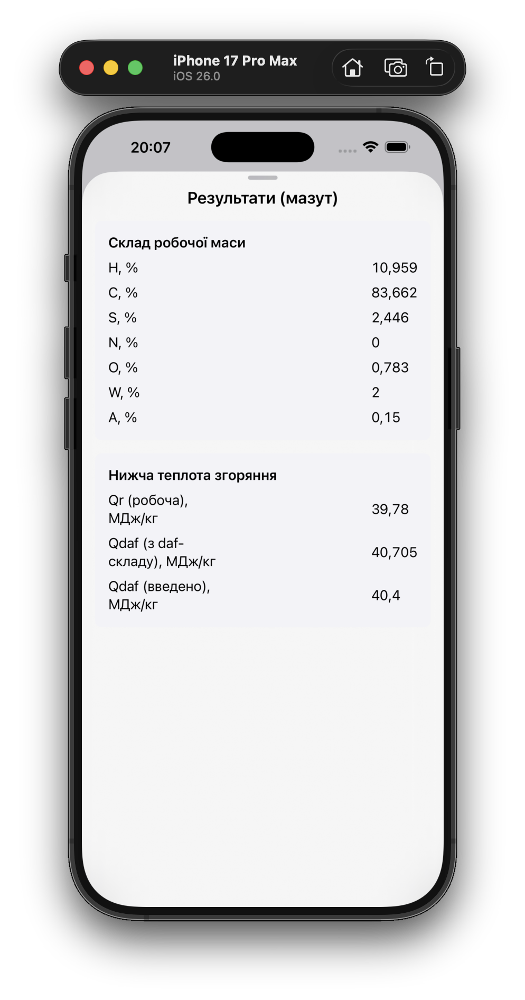
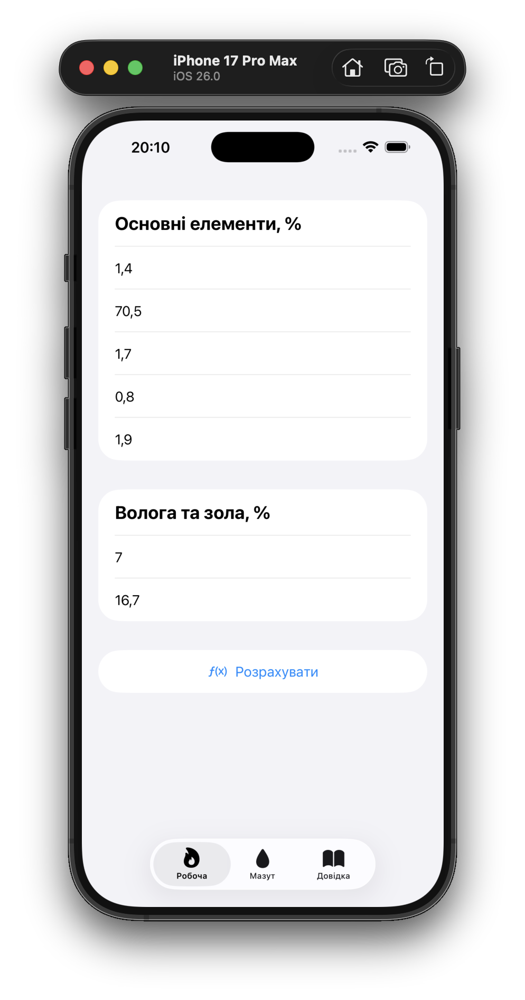
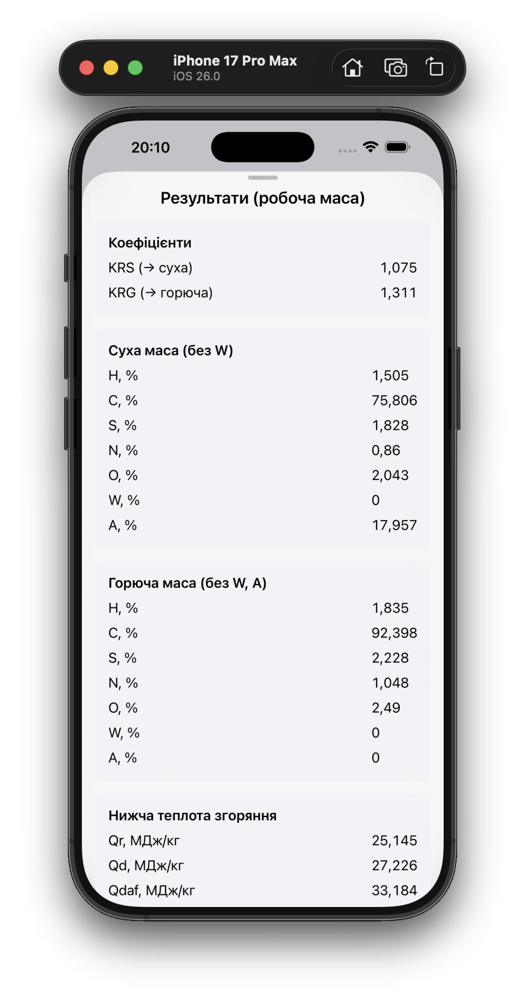

  

# FuelCalc

— мобільний калькулятор для iOS, який допомагає виконувати перерахунки складу палива та визначати нижчу теплоту згоряння для різних баз: робочої, сухої та горючої.

Додаток розроблений у рамках практичної роботи з дисципліни, має три вкладки:

<table>
  <tr>
    <td align="center"></td>
    <td align="center"></td>
    <td align="center"></td>
  </tr>
</table>

## 🔬 Теоретичні основи

У паливі розрізняють кілька баз для вираження складу та теплотворної здатності:

- **Робоча маса (Wr)** — містить як природну вологу **W**, так і золу **A**
- **Суха маса (Sd)** — паливо без вологи (**W = 0**)
- **Горюча маса (Gd, або daf — dry ash free)** — паливо без вологи та золи (**W = 0, A = 0**)

### Перерахунок складу

Для переходу від робочої маси до сухої та горючої використовуються коефіцієнти:

KRS = 100 / (100 − W) (перехід до сухої маси)
KRG = 100 / (100 − W − A) (перехід до горючої маси)

Тоді склад елемента `X` у сухій та горючій масі:

X_d = X_r · KRS
X_daf = X_r · KRG

Після перерахунку склад нормалізують так, щоб сума дорівнювала 100%.

### Формула Менделєєва для нижчої теплоти згоряння

Нижча теплота згоряння обчислюється за формулою:

Q = 339·C + 1030·H − 108.8·(O − S) − 25·W [кДж/кг]

У розрахунках застосунку значення подаються в **МДж/кг** (ділення на 1000).

Позначення:

- **Qr** — теплота на робочу масу
- **Qd** — теплота на суху масу
- **Qdaf** — теплота на горючу масу

## 🔥 Робоча маса

Вкладка для перерахунку складу з **робочої маси** до **сухої та горючої**, а також обчислення теплоти згоряння:

- Ввід: `H, C, S, N, O, W, A (%)`
- Вивід:
  - коефіцієнти переходу `KRS`, `KRG`
  - склад сухої та горючої маси (таблиці)
  - теплоти `Qr`, `Qd`, `Qdaf`

### Контрольний приклад

<table>
  <tr>
    <td align="center"></td>
    <td align="center"></td>
  </tr>
</table>

## 🛢 Мазут

Вкладка для розрахунку параметрів **мазуту**: перехід із горючої маси (daf) до робочої маси, а також обчислення теплоти згоряння.

- Ввід: `Cg, Hg, Og, Sg (%)`, `Qdaf (МДж/кг)`, `Wr (%)`, `Ad (%)`, `V (мг/кг)`
- Вивід:
  - склад робочої маси (нормалізований)
  - теплота згоряння `Qr`
  - порівняння обчисленого та введеного `Qdaf`

### Контрольний приклад

<table>
  <tr>
    <td align="center"></td>
    <td align="center"></td>
  </tr>
</table>

## 📖 Довідка

Окрема вкладка з теоретичними поясненнями, які допомагають зрозуміти

- різницю між робочою, сухою та горючою масами
- формулу Менделєєва для теплоти згоряння
- алгоритм розрахунків для обох завдань
- правила валідації даних у додатку

### Результати отримані у відповідності до варіанту 8

<table>
  <tr>
    <td align="center"></td>
    <td align="center"></td>
  </tr>
</table>

## 🛠 Використані технології

- **Swift 6** — сучасна мова програмування від Apple
- **SwiftUI** — декларативний фреймворк для побудови інтерфейсу користувача
- **iOS 26+ SDK** — остання версія операційної системи для мобільних пристроїв Apple
- **Xcode 16+** — середовище розробки та збірки проєкту

### Архітектура

- **MVVM (спрощена)** — логіка обчислень винесена у `Calculator.swift`, подання результатів інкапсульовано в окремому компоненті `ResultSheet.swift`
- Використання `@State` та `@FocusState` для керування станом та фокусом вводу
- Розділення на окремі вʼю:
  - `RawMassView.swift`
  - `OilView.swift`
  - `HelpView.swift`
  - `ResultSheet.swift`
  - `Calculator.swift`

### Інтерфейс

- **TabView** з трьома вкладками: Робоча маса, Мазут, Довідка
- **Bottom Sheet** (Liquid Glass style) для відображення результатів
- Використання **ScrollView** у довідці та вікні результатів для відображення довгого тексту
- Валідація полів у реальному часі
  - значення підсвічується **червоним після завершення вводу**, якщо воно некоректне
  - поля з відсотками — тільки **0…100%**
  - `Qdaf` (МДж/кг) ≥ 0
  - `V` (мг/кг) ≥ 0
  - перевірка суми
    - **RawMass**: H+C+S+N+O+W+A = 100 ± 0.5%
    - **Oil**: Cg+Hg+Og+Sg = 100 ± 0.5%

### Тестування

- **Тестування на реальному пристрої** (iPhone 15 Pro).
- Валідація сценаріїв:
  - правильні дані (контрольний приклад із методички)
  - помилки у форматі (букви, спецсимволи)
  - вихід за межі діапазонів
  - некоректна сума %
- Перевірка UX
  - неможливість відкрити результати при помилках
  - алерти з поясненнями
